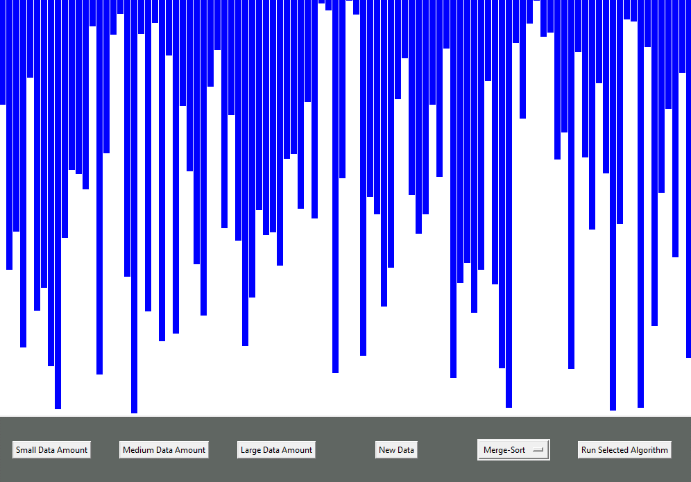

# Sorting Algorithm Visualizer
This Python program visualizes the three sorting algorithms bubble sort, merge sort and quick sort. You can select the amount of data being displayed and which algorithm to pick as well as pick a new data set.

Here is a preview:

## Requirements
Recommended: Python 3.7+\
Uses the built in Tkinter GUI library